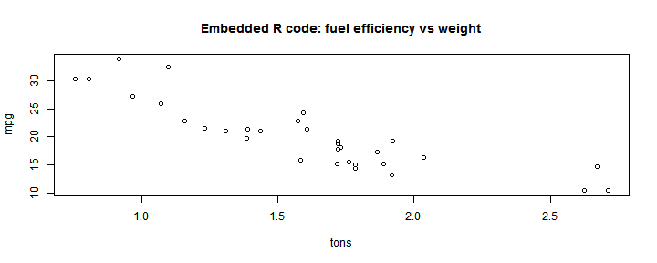
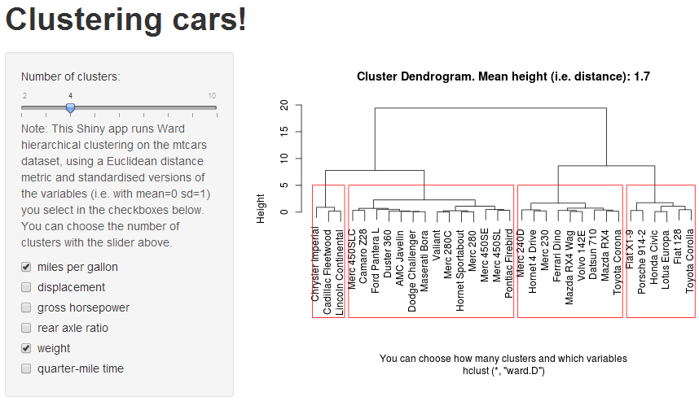

## What do you want?

Do you want to: 

1. Widen the number of cars you consider for your next purchase? 
2. Write comparisons of similar cars, but you don't know which cars are similar?
3. Be a petrolhead and understand more about cars?
4. Check checkboxes and slide sliders, just to see what happens?
5. Peer assess work on the Developing Data Products course?

If any of your answers are YES then [this](https://henrygb.shinyapps.io/car_cluster/) is the interactive application for you.

--- .class #id 

## Bored with flat R plots which make you think?

You could look at static graphs like this which make you consider the numbers

```r
mpg <- mtcars$mpg
tons <- mtcars$wt/2
plot(mpg ~ tons, main = "Embedded R code: fuel efficiency vs weight")
```

 

**You don't have time for that**

---

## Illustration of application

This is what you will see at [https://henrygb.shinyapps.io/car_cluster/](https://henrygb.shinyapps.io/car_cluster/), but there it is interactive:

<a href="https://henrygb.shinyapps.io/car_cluster/"></a>

---

## Choices

 - If you want to save time: choose your priority issues and the number of clusters and you immediately get the answer redrawn in front of your eyes
 - If you want to waste time: click and unclick the check boxes and slide the slider and watch the results magically change in front of your eyes
 
 - If you want more cars in each cluster: reduce the numbers of clusters
 - If you want tighter clusters of similar cars: increase the numbers of clusters
 
 - If you want to save the world and your own money: choose mpg as a variable
 - If it is all about speed: choose quarter-mile time as a variable

**Go now** to the [Shiny car cluster application](https://henrygb.shinyapps.io/car_cluster/). *You know you want to.*
